# Go4Lunch
A collaborative application that help you choose a restaurant to eat at with your workmates for lunch. See the restaurants near your position, find out who eats in which restaurant...

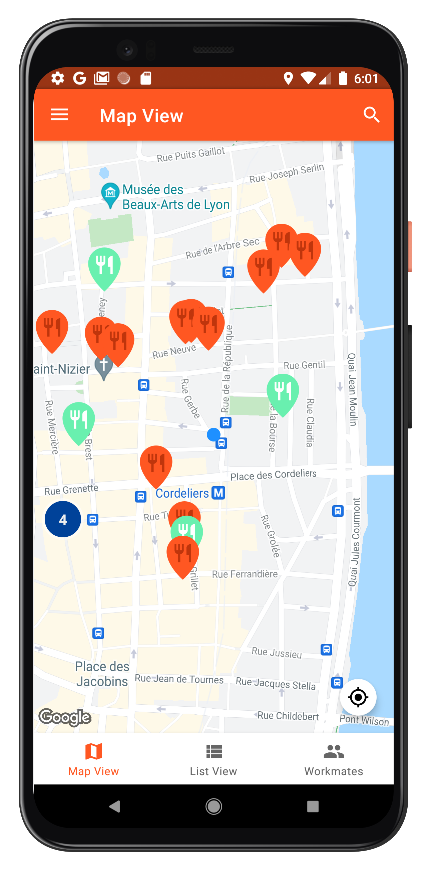 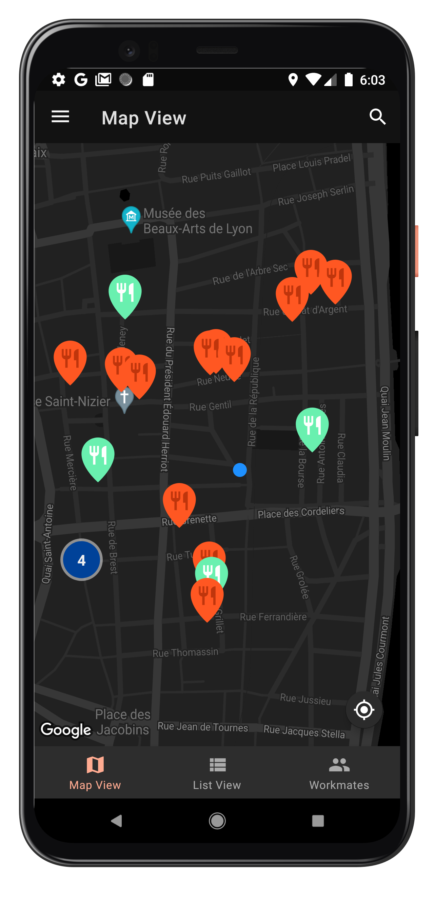
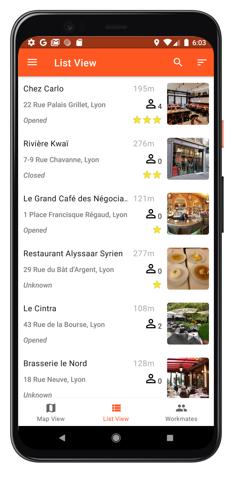 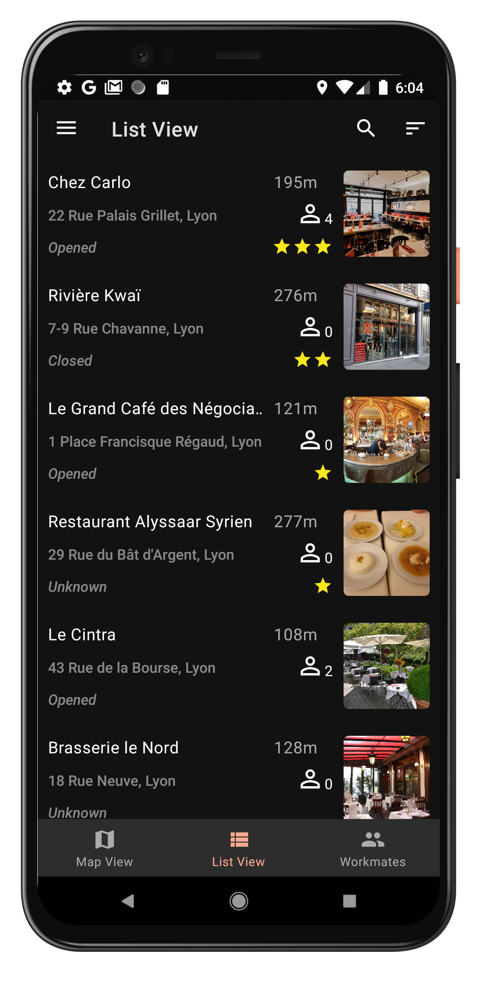
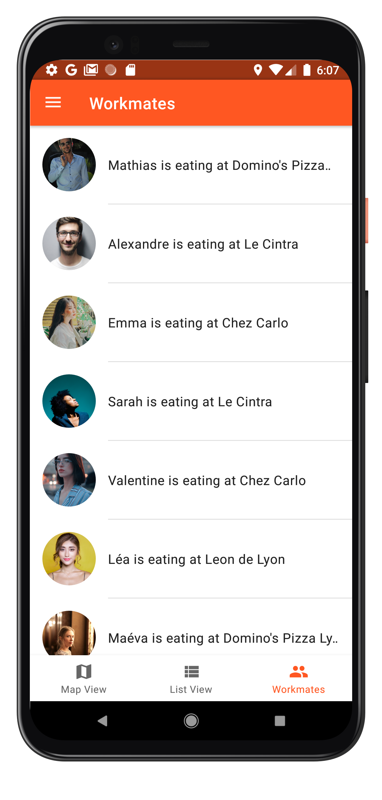 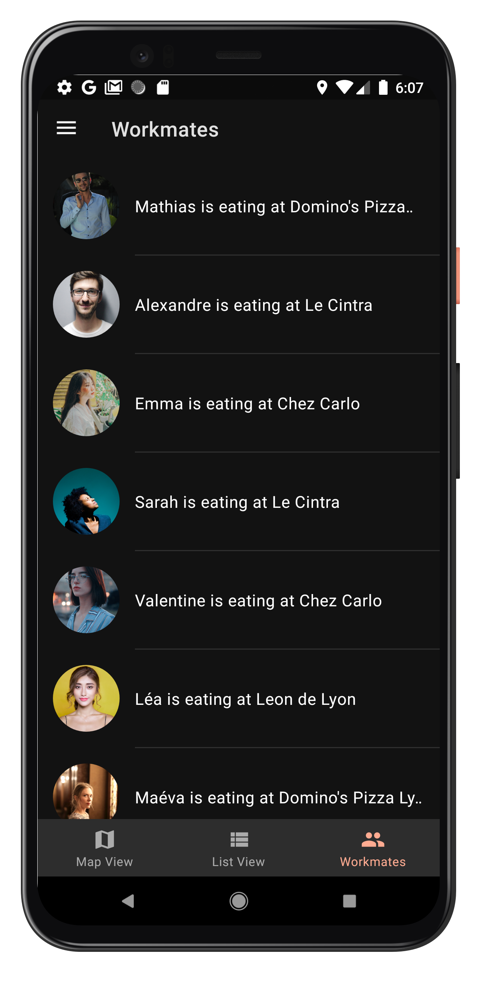
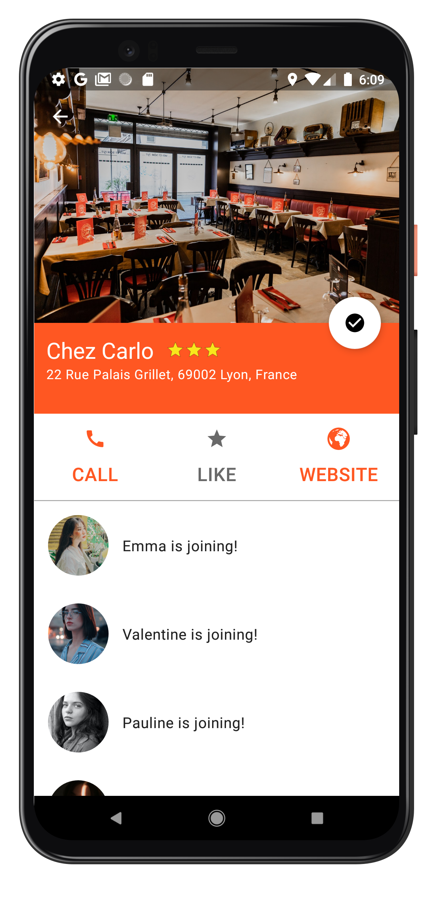 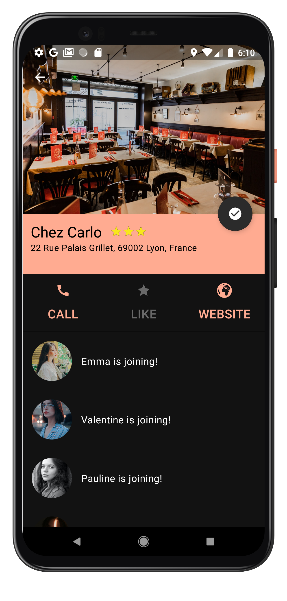
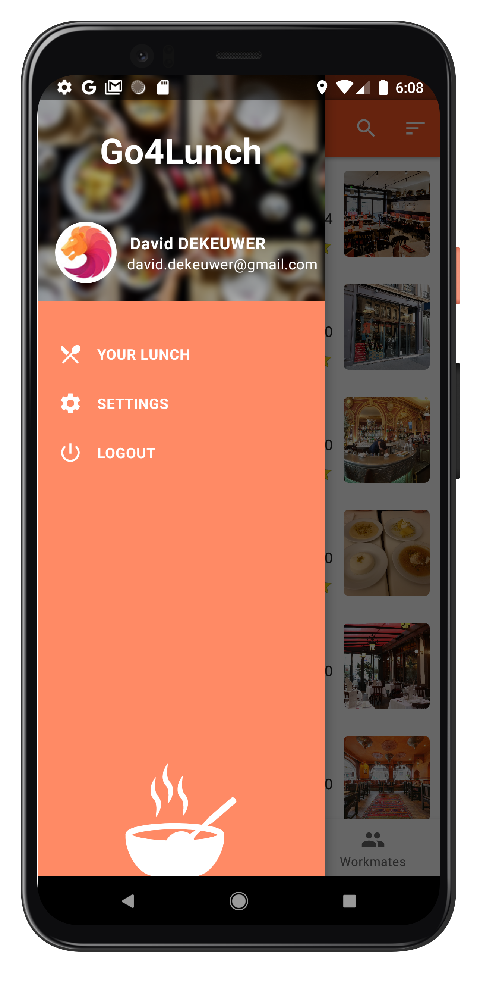 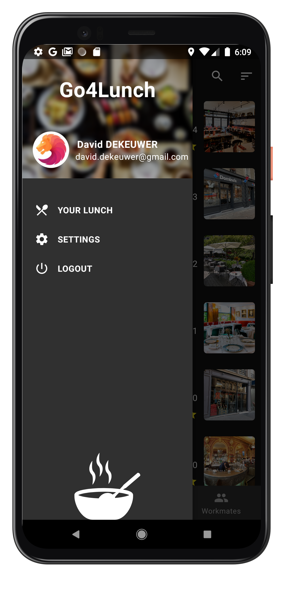
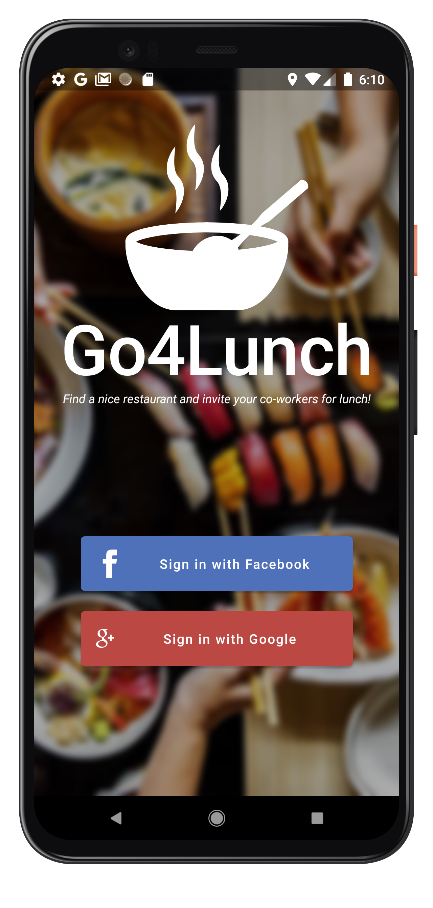 

## What's the problem
Have you ever struggled organizing your lunch time at work? Some of your workmates want to eat in this restaurant, some in that one and you're pretty new there so you don't know much about the restaurants around.  

Choosing a restaurant at lunch with your workmates becomes harder as the company you're in grows!

## Solution
To avoid that unawareness and to organize the lunches at work I decided to develop an application called "Go4Lunch".
This application simplifies the process of:
* Getting some information about the restaurants near your position
* Knowing which workmate eats in which restaurant
* Knowing the website or the phone number of a restaurant

## Features
* **Log in** the user with either a **Google** account or a **Facebook** account
* **Geolocalise** the user and showing the **nearby restaurants** within a **Map**
* **Search** a restaurant by its name
* Indicate if at least one workmate has chosen a restaurant by changing the color of the marker on the map
* Show a list of the nearby restaurants with **more** information:
  * the name
  * the photo
  * the address
  * the rating
  * the opening hours
  * the number of workmates joining
  * the distance between the user's position and the restaurant's position
* **Sort** the list by distance, rating or by the number of workmates joining
* A **detail** screen with more information of a particular restaurant:
  * the photo
  * the rating
  * the phone number
  * the website
  * the list of the workmates joining
* **Like** a restaurant
* **Notify** the user every 12 AM on which restaurant he's going to eat today and which workmates are joining him
* Show a list of the **workmates** with the name of the restaurant they've chosen (if exists)
* A dark mode is implemented
* A communication with a **back-end**

## Technologies
* RxJava, RxAndroid
* Retrofit
* Dagger Hilt
* Datastore
* Preferences (Settings)
* Work Manager
* Glide
* View binding
* Maps Android SDK
* Maps's Places API
* Facebook SDK
* Firebase Auth
* Firebase Firestore
